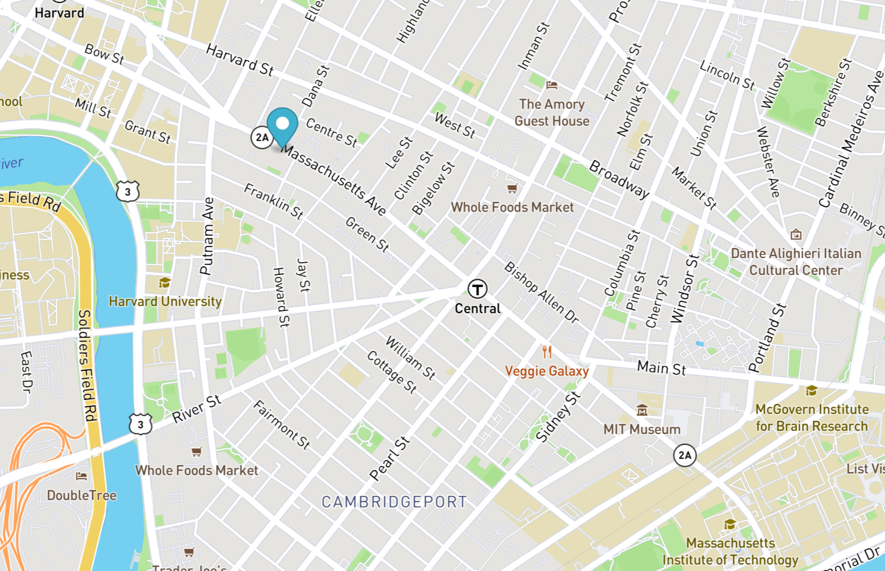

# Real Time Bus Tracker
This Real Time Bus Tracker exercise contains code for showing the bus stops between Harvard and MIT using the MBTA bus data. It uses an animated marker to highlight the bus routes on the displayed map.

## How To Run
In order to run this code after cloning the repo, open index.html in a browser. From there, click on the "Show stops between MIT and Harvard" button to start the animation.

## Roadmap of Future Improvements
In the future, the hope is to improve on this project with the addition of "Stop" and "Start" buttons that will allow the user to have more control over the animation. Another potential improvement would be to show a line tracking the routes to follow the animated marker to better visualize the route.

## License
MIT License

Copyright (c) 2022 Mariah Villanueva

Permission is hereby granted, free of charge, to any person obtaining a copy
of this software and associated documentation files (the "Software"), to deal
in the Software without restriction, including without limitation the rights
to use, copy, modify, merge, publish, distribute, sublicense, and/or sell
copies of the Software, and to permit persons to whom the Software is
furnished to do so, subject to the following conditions:

The above copyright notice and this permission notice shall be included in all
copies or substantial portions of the Software.

THE SOFTWARE IS PROVIDED "AS IS", WITHOUT WARRANTY OF ANY KIND, EXPRESS OR
IMPLIED, INCLUDING BUT NOT LIMITED TO THE WARRANTIES OF MERCHANTABILITY,
FITNESS FOR A PARTICULAR PURPOSE AND NONINFRINGEMENT. IN NO EVENT SHALL THE
AUTHORS OR COPYRIGHT HOLDERS BE LIABLE FOR ANY CLAIM, DAMAGES OR OTHER
LIABILITY, WHETHER IN AN ACTION OF CONTRACT, TORT OR OTHERWISE, ARISING FROM,
OUT OF OR IN CONNECTION WITH THE SOFTWARE OR THE USE OR OTHER DEALINGS IN THE
SOFTWARE.
